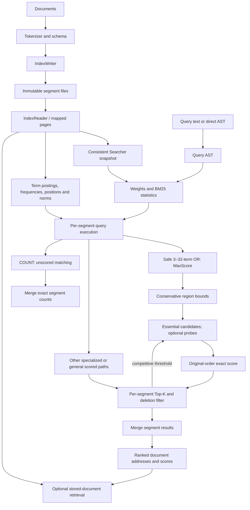

# Search execution in the Tantivy fork

Documents are tokenized and written into immutable segment files. Posting lists
map each term to physical document IDs and frequencies; positions support phrase
queries, and field norms supply encoded document lengths. Stored documents and
fast fields serve retrieval and sorting. The reader maps these files and publishes
a consistent Searcher snapshot; opening a reader does not score the corpus.

A parsed or directly constructed query becomes an AST. Searcher builds weights
using collection statistics and the configured BM25 parameters, then evaluates
each segment with its own collector. Term queries create posting cursors. Boolean
and phrase queries choose specialized paths when their shape/combiner permits it,
otherwise use general scorers. COUNT has a separate unscored path.

For safe 3–32-term OR sums, MaxScore divides clauses into essential and optional
sets under conservative region bounds. Only essential postings drive candidates.
Optional postings are sought and scored when their contribution could still make
a candidate competitive. Local proofs expire at their physical region boundary;
selected global proofs can span many blocks when the remaining driver is sparse.
Actual seeks reconcile shallow-selected stale cursors before scoring.

Every published OR score replays the incoming f32 leaves in original clause order
through f64 and rounds once to f32. The per-segment Top-K heap supplies the current
competitive threshold; rising thresholds prune later candidates. The collector
filters deletions before heap insertion. Segment results are merged with stable
DocAddress tie ordering. Stored document retrieval occurs after ranking if requested.

Port lessons already integrated: MaxScore essential/optional driving and compact
region certificates. The measured refinement adds compact metadata
for hot doc/cost/bound tests, while original scoring cursors stay in incoming order.
Other port techniques (buffered windows, threshold repartition, richer impact levels)
remain separate hypotheses, with different arithmetic/memory/storage tradeoffs.

Source anchors: `core/searcher.rs::search_with_executor`,
`query/boolean_query/boolean_weight.rs::for_each_pruning`,
`query/boolean_query/or_maxscore.rs`, `query/term_query/term_scorer.rs`,
`collector/sort_key/sort_by_score.rs::collect_segment_top_k`, and
`postings/block_segment_postings.rs::seek_block`.
